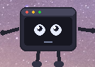
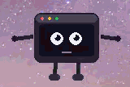

# Clawd Buddy

A tiny animated terminal pet that sits on your taskbar and reacts to [Claude Code](https://claude.ai/code) events. Works on **Windows** and **Linux**.

<!--  -->


## What it does

Clawd Buddy is a small always-on-top character that lives on your taskbar while you work with Claude Code:

| State | What happens |
| --- | --- |
| **Idle** | Gently bobs, blinks, breathes — your quiet companion |
| **Assistant finishes** (`Stop` hook) | Celebrates with confetti, happy eyes, and waving arms |
| **Assistant needs permission** (`PermissionRequest` hook) | Waves at you with a floating **!** so you know to check back |

### Themes

Clawd Buddy supports **dark** and **light** color themes:

```bash
clawd-buddy --theme dark    # default
clawd-buddy --theme light   # light body, light screen
```

You can also toggle the theme at any time from the system tray icon menu.

## Platform support

| Platform | Transparency | Always-on-top | Autostart |
| --- | --- | --- | --- |
| **Windows 10/11** | Color-key (fully transparent background) | Win32 `HWND_TOPMOST` | VBS in Startup folder |
| **Linux (X11)** | Themed background (dark or light) | `_NET_WM_STATE_ABOVE` | `.desktop` in `~/.config/autostart/` |

> **Linux notes:** Requires an X11 session (Wayland restricts window positioning and always-on-top). Most Wayland desktops support XWayland — set `SDL_VIDEODRIVER=x11` (done automatically). Panel/dock height is auto-detected via `_NET_WORKAREA`; falls back to 48px.

## Install

```bash
# With uv (recommended — installs as an isolated tool)
uv tool install clawd-buddy

# With pipx
pipx install clawd-buddy

# With pip (into current environment)
pip install clawd-buddy
```

### From source

```bash
git clone https://github.com/ramymagdy-rm/clawd-buddy.git
cd clawd-buddy
uv tool install --from . clawd-buddy
```

## Quick start

### 1. Launch the buddy

```bash
clawd-buddy
```

The buddy appears on your taskbar, centered at the bottom of the screen. It runs until you close it.

### 2. Run at startup (optional)

```bash
# Enable — buddy starts automatically at login
clawd-buddy --startup

# Disable — remove from startup
clawd-buddy --no-startup
```

- **Windows**: Places a VBS launcher in `shell:startup`. No console window appears.
- **Linux**: Creates a `.desktop` file in `~/.config/autostart/`.

### 3. Wire up Claude Code hooks

Add to your **global** Claude Code settings (`~/.claude/settings.json`) so every session triggers the buddy:

```json
{
  "hooks": {
    "Stop": [
      {
        "hooks": [
          {
            "type": "command",
            "command": "clawd-buddy --send done",
            "timeout": 5000
          }
        ]
      }
    ],
    "PermissionRequest": [
      {
        "hooks": [
          {
            "type": "command",
            "command": "clawd-buddy --wave",
            "timeout": 5000
          }
        ]
      }
    ]
  }
}
```

> **Note:** If you already have other hooks in your `settings.json`, merge the `Stop` and `PermissionRequest` entries into the existing `hooks` object.

### 4. Done

Start a Claude Code session anywhere. When the assistant finishes or needs your attention, the buddy reacts.

## CLI reference

```text
clawd-buddy                  Start buddy on taskbar
clawd-buddy --test           Start with a celebration animation
clawd-buddy --send MSG       Signal a running buddy to celebrate
clawd-buddy --wave           Signal a running buddy to wave (needs attention)
clawd-buddy --theme THEME    Color theme: dark (default) or light
clawd-buddy --startup        Enable run at login/startup
clawd-buddy --no-startup     Disable run at login/startup
clawd-buddy --port PORT      Use a custom TCP port (default: 44556)
clawd-buddy --no-topmost     Don't keep the window always-on-top
clawd-buddy --fg             Run in foreground (skip auto-detach)
clawd-buddy --help           Show help
```

## Controls

| Input | Action |
| --- | --- |
| **Drag** | Click anywhere on the buddy and drag to reposition |
| **Space** | Trigger a test celebration |
| **Ctrl+1** | Scale to 100% (default) |
| **Ctrl+2** | Scale to 125% |
| **Ctrl+3** | Scale to 150% |
| **Ctrl+4** | Scale to 200% |
| **Escape** | Quit the buddy |
| **Tray icon** | Right-click the system tray icon for a menu |

## How it works

### Architecture

```text
Claude Code                            Clawd Buddy
-----------                            -----------
 hooks/Stop ──> clawd-buddy --send ──> TCP:44556 ──> celebrate animation
 hooks/PermissionRequest ──> clawd-buddy --wave ──> TCP:44556 ──> wave animation
```

1. **Claude Code hooks** fire shell commands when events happen (response done, permission needed).
2. The `clawd-buddy --send` / `--wave` CLI connects to `127.0.0.1:44556` and sends a JSON action.
3. The running buddy process receives the signal and plays the animation.

### Signal protocol

The buddy listens on a TCP socket (default port `44556`). Send a JSON payload to trigger actions:

```json
{"action": "celebrate"}
```

```json
{"action": "wave"}
```

You can send signals from any language:

```python
import socket, json
s = socket.socket()
s.connect(("127.0.0.1", 44556))
s.sendall(json.dumps({"action": "celebrate"}).encode())
s.close()
```

```bash
echo '{"action": "wave"}' | nc localhost 44556
```

### Single instance

Only one buddy can run at a time. If you launch `clawd-buddy` while one is already running, it sends a signal to the existing instance and exits.

### System tray

The buddy adds a system tray icon with a right-click menu:

- **Test Celebration** — trigger the celebrate animation
- **Quit** — close the buddy

### Autostart

`clawd-buddy --startup` registers the buddy to launch at login. `clawd-buddy --no-startup` removes it.

- **Windows**: Places a VBS launcher in `%APPDATA%\Microsoft\Windows\Start Menu\Programs\Startup\`. Starts with a hidden console window.
- **Linux**: Creates a `.desktop` file in `~/.config/autostart/`. Uses the XDG autostart standard supported by GNOME, KDE, XFCE, and others.

## Animations

### Idle

- Gentle vertical bobbing (sine wave)
- Periodic blinking (every ~5 seconds)
- Pupils wander slowly
- Small mouth line with subtle movement
- Arms sway gently at sides

### Celebrate (on `Stop`)

- Fast bouncing
- Happy arc eyes (^ ^)
- Wide smile
- Both arms waving up
- Legs kicking
- Confetti burst (40 particles with gravity and drag)
- Duration: 3.5 seconds

### Wave (on `PermissionRequest`)

- Medium bobbing
- Wide alert eyes (large pupils, staring)
- Surprised "o" mouth
- Right arm waving high
- Pulsing floating **!** indicator above head
- Duration: 5 seconds

## Configuration

### Custom port

If port `44556` is taken, use a different one:

```bash
clawd-buddy --port 55000
```

Update your hooks to match:

```json
"command": "clawd-buddy --send done --port 55000"
```

### Disable always-on-top

```bash
clawd-buddy --no-topmost
```

## Troubleshooting

### Buddy doesn't appear

- **Windows**: Make sure no other process is using port `44556`: `netstat -ano | findstr 44556`
- **Linux**: Requires an X11 session. If you're on Wayland, the buddy forces `SDL_VIDEODRIVER=x11` via XWayland. If it still doesn't appear, try `clawd-buddy --fg` to see errors in the terminal.
- **macOS**: Not yet supported.

### Hook doesn't trigger the buddy

- Make sure the buddy is running (`clawd-buddy` in a terminal or via `--startup`).
- Test manually: `clawd-buddy --send test` — if this says "No buddy on port 44556", the buddy isn't running.
- Check that `clawd-buddy` is on your PATH: `where clawd-buddy` (Windows) / `which clawd-buddy` (Linux)

### Multiple buddies / port conflict

- The buddy uses a lock socket on port `44557` (main port + 1) to prevent duplicates.
- **Windows**: `taskkill /F /IM clawd-buddy.exe`
- **Linux**: `pkill -f clawd-buddy`

### Startup not working

**Windows:**

- Verify the VBS file exists: `dir "%APPDATA%\Microsoft\Windows\Start Menu\Programs\Startup\clawd-buddy*"`
- Re-run `clawd-buddy --startup` to regenerate it.

**Linux:**

- Verify the desktop file exists: `ls ~/.config/autostart/clawd-buddy.desktop`
- Re-run `clawd-buddy --startup` to regenerate it.
- Make sure `clawd-buddy` is on your PATH: `which clawd-buddy`

### Linux: window has a visible background

On Linux, color-key transparency is not available. The buddy renders on a themed background (dark or light). Use `--theme light` on light panels/docks, or `--theme dark` on dark ones to blend in.

## Disclaimer

Clawd Buddy is an independent open-source project. It is not affiliated with, endorsed by, or sponsored by Anthropic. "Claude" and "Claude Code" are trademarks of Anthropic, PBC.

## License

[MIT](LICENSE)
