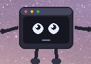
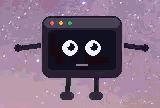

# Clawd Buddy

A tiny animated terminal pet that sits on your taskbar and reacts to [Claude Code](https://claude.ai/code) events. Works on **Windows** and **Linux**.

<!--  -->


## What it does

Clawd Buddy is a small always-on-top character that lives on your taskbar while you work with Claude Code:

| State | What happens |
| --- | --- |
| **Idle** | Gently bobs, blinks, breathes — your quiet companion |
| **New session begins** (`UserPromptSubmit` hook, first prompt) | Greets with a soft wave, a smaller smile, and a pulsing **cyan** border |
| **Assistant is thinking** (between `UserPromptSubmit` and `Stop`) | Pupils sweep upward, three pulsing dots float above the head, gentle **purple** border |
| **Assistant finishes** (`Stop` hook) | Celebrates with confetti, happy eyes, waving arms, a short motivational fanfare, and a pulsing **green** border |
| **Assistant needs permission** (`PermissionRequest` hook) | Waves with a floating **!**, a warm two-note doorbell call, and a pulsing **yellow** border |

> If multiple signals arrive in quick succession (e.g. a `PermissionRequest`
> while a celebrate is still animating), the buddy now **queues** them
> instead of dropping them — up to three pending reactions play back in
> the order they arrived.

### Notification sound packs

Pick the audio style from the system-tray right-click menu → **Sound**.
Four packs ship in the box, plus an **Off** entry to mute. Clicking a pack
**previews the celebrate sound immediately** so you can audition options
without waiting for the next event.

| Pack | Celebrate | Wave |
| --- | --- | --- |
| `Fanfare` (default) | Motivational ascending C-major arpeggio that lands on a full triad chord | Warm two-note doorbell (G4 → D4) |
| `Chime` | Two ascending bell tones with harmonic decay | Single lower bell |
| `Retro` | 8-bit square-wave coin-pickup flourish (C5 → E5 → G5 → C6) | Two short low-high blips |
| `Minimal` | Single short soft pip | Single short low pip |
| `Off` | (silent) | (silent) |

No audio file is bundled — every pack is synthesized at startup with
`pygame.mixer` (summed sine / square / bell-decay voices with raised-cosine
envelopes). Your choice persists across launches in `config.json` under
`"sound_pack"`.

Toggle from the system-tray right-click menu → **Sound**. The choice is
remembered between launches (saved alongside the theme in `config.json`).
If your machine has no audio device, the buddy logs a one-line warning and
runs silently while the visual border still works.

### Comfort & accessibility

Three preferences keep the buddy polite across motion sensitivities,
audio environments, and quiet hours:

- **Reduce motion** (system-tray → **Reduce Motion** toggle).
  When on, the buddy stops bobbing, swinging limbs, and spawning
  confetti. The pulsing colored border and notification sounds remain
  — the signaling minimum — so you can still tell when Claude is
  greeting, thinking, waving, or celebrating.
- **Volume** (system-tray → **Sound** → **Volume**).
  Discrete steps from **0% to 100%** scale the active pack's per-event
  base levels (celebrate is intentionally louder than wave). Clicking a
  level previews the celebrate sound at the new volume.
- **Quiet hours** (system-tray → **Sound** → **Quiet Hours**).
  Pick a preset window — typical nights, e.g. `23:00 – 08:00` — and
  the buddy mutes every notification sound inside the window (the
  visual animations still play). The schedule wraps across midnight.
  Choose **Off** to disable.

All three settle into `config.json` under `reduce_motion`, `volume`,
and `quiet_hours` (`{start, end}` minutes-from-midnight) — the same
file as the theme and sound pack. Defaults: motion on, volume 100%,
quiet hours off.

### Water reminder

The buddy can nudge you to drink water on a schedule. Off by default
— turn it on from the system tray (**Water Reminder** toggle) or
from the **About → Reminders** tab where every preference lives:

| Setting | Options |
| --- | --- |
| **Interval** | `30 min`, `1 h` (default), `1.5 h`, `2 h`, `4 h` — picked from a scrolling dropdown directly under the **Remind me to drink water** checkbox |
| **Start reminders at** | HH:MM combobox (30-min steps, default **08:00**). The day's schedule cycles from this anchor: with start=09:00 and interval=1 h, reminders land at 09:00, 10:00, 11:00, … |
| **Sound** | `water` (default — high-pitched bell), `chime` (calmer two-bell pair), `beep` (square-wave triple-blip), or `off` for visual-only |
| **Quiet hours** | Default **23:00–08:00**, edited via HH:MM comboboxes in 30-min increments. Pick the same time for both endpoints to disable. |

When the reminder fires:

- The chosen sound plays once (no looping nag).
- The buddy shows a **"Drink water!"** speech bubble until you ack.
- **Press Space** to acknowledge — the bubble clears. The *next*
  scheduled slot still fires on time (drinking ack doesn't shift the
  schedule). Space keeps its old "test celebration" meaning at every
  other moment, so you haven't lost the shortcut.
- Or click **I drank water** in the tray menu (visible only while an
  alarm is active).
- Or signal externally: `clawd-buddy --drank` works the same way for
  smart-bottle integrations, wrist macros, or scripts.

Inside quiet hours the buddy silently consumes the scheduled slots —
on exit, only the next *future* slot fires, not every slot you were
meant to sleep through. Reminder prefs persist under a `reminder`
block in `config.json` (`enabled`, `interval`, `anchor_minute`,
`sound`, `quiet_hours`).

### Drinking history

Every drink-ack — Space, the tray entry, the About-window button, or
`clawd-buddy --drank` — increments a per-day cup counter that lives in
**`~/.clawd-buddy/history.json`** (`C:\Users\<name>\.clawd-buddy\` on
Windows, `~/.clawd-buddy/` on Linux). The path is intentionally
separate from `config.json` — settings sit in the platform config dir,
**runtime data sits in the home directory** where it's easy to back up
or sync via dotfile management.

The **About → Reminders** tab shows:

- **`3 cups today`** (bold headline, with singular/plural handling)
- **`Recent days: 6 · 5 · 7 · 4 · 5 · 6 · 3`** (last 7 days, newest first)

Both lines tick live on the same 1 Hz refresh as the countdown, and
update immediately when you click the **I drank water now** button.

Crossing local midnight closes out the in-progress day into the recent
list and resets the count to zero. Empty days (zero acks) are skipped
so the recent list only carries meaningful data.

Schema (small enough to hand-edit if you ever need to):

```json
{
  "today":  { "date": "2026-05-25", "count": 3 },
  "recent": [
    { "date": "2026-05-24", "count": 6 },
    { "date": "2026-05-23", "count": 5 }
  ]
}
```

The counter is independent of whether the reminder is enabled — manual
logging works either way, so you can use the buddy as a pure water-
tracker without the nag.

### Themes

Clawd Buddy ships with **8 color themes** — a mix of dark and light with several popular palettes:

| # | Theme | Flavor |
| --- | --- | --- |
| 1 | `dark` | Classic dark blue-gray (default) |
| 2 | `light` | Classic soft light |
| 3 | `dracula` | Dark with purple / pink accents |
| 4 | `monokai` | Dark with green / pink accents |
| 5 | `nord` | Cool nordic blue |
| 6 | `gruvbox` | Warm retro dark |
| 7 | `solarized` | Muted solarized light |
| 8 | `sunset` | Warm peach / orange light |

Pick one at launch:

```bash
clawd-buddy --theme dark        # default
clawd-buddy --theme dracula
clawd-buddy --theme sunset
```

Switch at runtime from the **Theme** submenu on the system-tray icon
(right-click the clawd-buddy tray icon → **Theme** → pick one). The active
theme is marked as a radio item.

Your choice is **remembered between launches**. The buddy stores the last
theme in:

- **Windows:** `%APPDATA%\clawd-buddy\config.json`
- **Linux:** `$XDG_CONFIG_HOME/clawd-buddy/config.json`
  (falls back to `~/.config/clawd-buddy/config.json`)

Passing `--theme <name>` at launch overrides *and* updates the remembered
theme, so the override sticks for next time too. First-run default is `dark`.

## Platform support

| Platform | Transparency | Always-on-top | Autostart |
| --- | --- | --- | --- |
| **Windows 10/11** | Color-key (fully transparent background) | Win32 `HWND_TOPMOST` | VBS in Startup folder |
| **Linux (X11)** | Themed background (dark or light) | `_NET_WM_STATE_ABOVE` | `.desktop` in `~/.config/autostart/` |

> **Linux notes:** Requires an X11 session (Wayland restricts window positioning and always-on-top). Most Wayland desktops support XWayland — set `SDL_VIDEODRIVER=x11` (done automatically). Panel/dock height is auto-detected via `_NET_WORKAREA`; falls back to 48px.

## Install

```bash
# With uv (recommended — installs as an isolated tool)
uv tool install clawd-buddy

# With pipx
pipx install clawd-buddy

# With pip (into current environment)
pip install clawd-buddy
```

### From source

```bash
git clone https://github.com/ramymagdy-rm/clawd-buddy.git
cd clawd-buddy
uv tool install --from . clawd-buddy
```

### Update

```bash
# With uv
uv tool install --upgrade clawd-buddy

# With pipx
pipx upgrade clawd-buddy

# With pip
pip install --upgrade clawd-buddy
```

## Quick start

### 1. Launch the buddy

```bash
clawd-buddy
```

The buddy appears on your taskbar, centered at the bottom of the screen. It runs until you close it.

### 2. Run at startup (optional)

```bash
# Enable — buddy starts automatically at login
clawd-buddy --startup

# Disable — remove from startup
clawd-buddy --no-startup
```

- **Windows**: Places a VBS launcher in `shell:startup`. No console window appears.
- **Linux**: Creates a `.desktop` file in `~/.config/autostart/`.

### 3. Wire up Claude Code hooks

Add to your **global** Claude Code settings (`~/.claude/settings.json`) so every session triggers the buddy:

```json
{
  "hooks": {
    "UserPromptSubmit": [
      {
        "hooks": [
          {
            "type": "command",
            "command": "clawd-buddy --prompt-start",
            "timeout": 5000
          }
        ]
      }
    ],
    "Stop": [
      {
        "hooks": [
          {
            "type": "command",
            "command": "clawd-buddy --send done",
            "timeout": 5000
          }
        ]
      }
    ],
    "PermissionRequest": [
      {
        "hooks": [
          {
            "type": "command",
            "command": "clawd-buddy --wave",
            "timeout": 5000
          }
        ]
      }
    ]
  }
}
```

> **Note:** If you already have other hooks in your `settings.json`, merge the new entries into the existing `hooks` object.
>
> `--prompt-start` does two things in one: a soft **greeting** on the
> first prompt of each Claude Code session (de-duplicated by `session_id`
> read from the hook's stdin payload), then enters the **thinking**
> animation that runs until `Stop` arrives. Wiring it is optional —
> without it, the buddy still celebrates and waves, just without the
> session-start and mid-response reactions.

### 4. Done

Start a Claude Code session anywhere. When the assistant finishes or needs your attention, the buddy reacts.

## CLI reference

```text
clawd-buddy                  Start buddy on taskbar
clawd-buddy --test           Start with a celebration animation
clawd-buddy --send MSG       Signal a running buddy to celebrate
clawd-buddy --wave           Signal a running buddy to wave (needs attention)
clawd-buddy --message TEXT   Show a 3s speech bubble with TEXT above the
                             running buddy. Pass "" to dismiss any
                             current bubble immediately.
clawd-buddy --status         Print the running buddy's state as JSON
                             (version, pid, port, mode, queue depth,
                             theme, sound pack, bubble, last action,
                             plus M3 comfort prefs and the M4 reminder
                             block) and exit. Exit 1 if no buddy is
                             listening.
clawd-buddy --drank          Acknowledge the water-drinking reminder
                             (clears any active alarm + resets the
                             timer). Exit 1 if no buddy is listening.
clawd-buddy --prompt-start   Signal start of a Claude Code prompt — greets
                             on the first prompt of a new session, then
                             enters the thinking animation. Reads
                             session_id from JSON on stdin when run as a
                             hook command.
clawd-buddy --session-id ID  Override the session id used by --prompt-start
                             (mostly useful for scripts / tests)
clawd-buddy --top            Tell a running buddy to re-assert always-on-top
clawd-buddy --quit           Ask a running buddy to exit cleanly
clawd-buddy --theme THEME    Color theme: dark (default), light, dracula,
                             monokai, nord, gruvbox, solarized, sunset
clawd-buddy --startup        Enable run at login/startup
clawd-buddy --no-startup     Disable run at login/startup
clawd-buddy --port PORT      Use a custom TCP port (default: 44556)
clawd-buddy --no-topmost     Don't keep the window always-on-top
clawd-buddy --fg             Run in foreground (skip auto-detach)
clawd-buddy --version        Show version and exit
clawd-buddy --help           Show help
```

## Controls

| Input | Action |
| --- | --- |
| **Drag** | Click anywhere on the buddy and drag to reposition |
| **Space** | Trigger a test celebration |
| **Ctrl+1** | Scale to 100% (default) |
| **Ctrl+2** | Scale to 125% |
| **Ctrl+3** | Scale to 150% |
| **Ctrl+4** | Scale to 200% |
| **Escape** | Quit the buddy |
| **Tray icon** | Right-click the system tray icon for a menu — theme switcher lives here |

## How it works

### Architecture

```text
Claude Code                                          Clawd Buddy
-----------                                          -----------
 hooks/UserPromptSubmit ──> clawd-buddy --prompt-start ──> TCP:44556 ──> greet (if new session) + thinking
 hooks/Stop ─────────────> clawd-buddy --send ─────────> TCP:44556 ──> celebrate animation
 hooks/PermissionRequest ──> clawd-buddy --wave ────────> TCP:44556 ──> wave animation
```

1. **Claude Code hooks** fire shell commands when events happen
   (prompt submitted, response done, permission needed).
2. The `clawd-buddy --send` / `--wave` / `--prompt-start` CLI connects to
   `127.0.0.1:44556` and sends a JSON action.
3. The running buddy process receives the signal and plays the animation.
   Incoming signals during an active animation are queued (FIFO, capped
   at three) so attention requests are never silently dropped.

### Module layout

```text
src/clawd_buddy/
├── app.py          # main() orchestration
├── constants.py    # window dimensions, IPC port, transparency key
├── state.py        # BuddyState — animation state machine + queue
├── cli.py          # argparse setup + Claude Code hook stdin reader
├── config.py       # ~/.config/clawd-buddy persistence
├── ipc.py          # JSON-over-TCP protocol + dispatcher + client
├── ui/
│   ├── themes.py   # 8 color theme registry
│   ├── sound.py    # procedural PCM sound-pack generators
│   ├── drawing.py  # pygame draw routines (buddy + confetti)
│   ├── about.py    # About dialog + shared buddy icon
│   └── tray.py     # pystray icon + right-click menu
└── platform/
    ├── __init__.py # cross-platform facade
    ├── _windows.py # Win32 ctypes (transparency, taskbar, autostart)
    └── _linux.py   # X11 / XDG (window props, panel detection, .desktop)
```

Each module is independently importable and unit-tested (`tests/`).

### Signal protocol

The buddy listens on a TCP socket (default port `44556`). Send a JSON payload to trigger actions:

```json
{"action": "celebrate"}
```

```json
{"action": "wave"}
```

```json
{"action": "prompt_start", "session_id": "abc-123"}
```

The `prompt_start` action is the wire-once handler for a Claude Code
prompt: the running buddy greets when it sees a *new* `session_id` (or
when none is supplied and there has been no recent activity) and starts
the thinking animation either way.

The `status` action is the only one that elicits a response — the
buddy writes a JSON snapshot back on the same socket before closing:

```bash
$ clawd-buddy --status
{
  "version": "0.1.19",
  "pid": 12345,
  "port": 44556,
  "mode": "idle",
  "queue_depth": 0,
  "last_session_id": "abc-123",
  "last_action": "wave",
  "last_action_ts": 1716595200.0,
  "theme": "dark",
  "sound_pack": "fanfare",
  "topmost": true,
  "bubble_text": "",
  "reduce_motion": false,
  "volume": 1.0,
  "quiet_hours": {"start": "23:00", "end": "08:00"},
  "reminder": {
    "enabled": true,
    "interval_seconds": 3600,
    "anchor": "08:00",
    "sound": "water",
    "quiet_hours": {"start": "23:00", "end": "08:00"},
    "active": false,
    "seconds_until_next": 1742,
    "cups_today": 3,
    "today_date": "2026-05-25",
    "recent_days": [
      {"date": "2026-05-24", "count": 6},
      {"date": "2026-05-23", "count": 5}
    ]
  }
}
```

`reduce_motion`, `volume`, and `quiet_hours` were added in v0.1.15;
the `reminder` block was added in v0.1.16; `reminder.anchor` (the daily
schedule start time) was added in v0.1.18; `cups_today`, `today_date`,
and `recent_days` (the M4.1 drinking history) in v0.1.19. Both
`quiet_hours` keys are `null` when their respective window is disabled;
`reminder.seconds_until_next` is `null` when the reminder is off and
`0` when an alarm is firing.

This is the recommended "is the buddy alive?" probe — exit code 1 plus
a stderr message when no buddy is listening, exit code 0 with JSON on
stdout otherwise.

You can send signals from any language:

```python
import socket, json
s = socket.socket()
s.connect(("127.0.0.1", 44556))
s.sendall(json.dumps({"action": "celebrate"}).encode())
s.close()
```

```bash
echo '{"action": "wave"}' | nc localhost 44556
```

### Single instance

Only one buddy can run at a time. If you launch `clawd-buddy` while one is already running, it sends a signal to the existing instance and exits.

### System tray

The buddy adds a system tray icon with a right-click menu:

- **Test Celebration** — trigger the celebrate animation
- **Bring to Front** — re-assert always-on-top (recovers z-order)
- **Theme** — pick one of the 8 themes (current one is checked)
- **Sound** — pick a notification sound pack (`Off`, `Fanfare`, `Chime`, `Retro`, `Minimal`). Selecting a pack plays a preview immediately; the choice is persisted in `config.json`.
  - **Volume** — discrete steps `0%` / `25%` / `50%` / `75%` / `100%`. Selecting a step previews the celebrate sound at the new level.
  - **Quiet Hours** — `Off` or a preset night window (e.g. `23:00 – 08:00`). Inside the window all notification sounds are muted; animations still play.
- **Reduce Motion** — accessibility toggle. When checked, the buddy stops bobbing, swinging limbs, and spawning confetti; the colored attention border and sounds remain.
- **Water Reminder** — toggle the water-drinking reminder. Detailed config (interval, sound, quiet hours) lives in **About… → Reminders**.
- **I drank water** — *appears only while a reminder is firing*. Same effect as pressing Space when the alarm is active: dismiss the current alarm. The next scheduled slot still fires on time.
- **Clawd Buddy vX.Y.Z** — informational version label (disabled)
- **About…** — open a tabbed dialog: **About** (version / repo / author) and **Reminders** (edit interval, sound, and quiet hours; live countdown; "Drank now" button).
- **Quit** — close the buddy

### Autostart

`clawd-buddy --startup` registers the buddy to launch at login. `clawd-buddy --no-startup` removes it.

- **Windows**: Places a VBS launcher in `%APPDATA%\Microsoft\Windows\Start Menu\Programs\Startup\`. Starts with a hidden console window.
- **Linux**: Creates a `.desktop` file in `~/.config/autostart/`. Uses the XDG autostart standard supported by GNOME, KDE, XFCE, and others.

## Animations

### Idle

- Gentle vertical bobbing (sine wave)
- Periodic blinking (every ~5 seconds)
- Pupils wander slowly
- Small mouth line with subtle movement
- Arms sway gently at sides

### Celebrate (on `Stop`)

- Fast bouncing
- Happy arc eyes (^ ^)
- Wide smile
- Both arms waving up
- Legs kicking
- Confetti burst (40 particles with gravity and drag)
- Pulsing **green** border around the body
- Motivational C-major arpeggio + triad chord (if Sound is enabled)
- Duration: 3.5 seconds

### Wave (on `PermissionRequest`)

- Medium bobbing
- Wide alert eyes (large pupils, staring)
- Surprised "o" mouth
- Right arm waving high
- Pulsing floating **!** indicator above head
- Pulsing **yellow** border around the body
- Warm two-note doorbell call (if Sound is enabled)
- Duration: 5 seconds

### Greet (first prompt of a new session)

- Medium bobbing
- Small happy arc eyes
- Smaller smile
- Right arm raised in a friendly hello
- Pulsing **cyan** border around the body
- Silent (audio is intentionally deferred to a later milestone)
- Duration: ~1.8 seconds
- Per-session de-duplication via Claude Code's `session_id`

### Thinking (between `UserPromptSubmit` and `Stop`)

- Slow, calm bobbing
- Pupils sweep upward and side-to-side (a "considering" pose)
- Three small pulsing dots float above the head
- Soft **purple** border, gentler pulse than the other states
- Silent
- Holds indefinitely until `Stop` arrives (with a 10-minute safety cap
  in case the assistant crashes or the network drops)

> Reactions are **queued** while another animation is playing — up to
> three pending events play back in the order they arrived.

### Speech bubble (any tool, via `--message`)

- Triggered by `clawd-buddy --message "TEXT"`
- Rounded bubble above the buddy's head with a small downward tail
- Theme-coloured (uses the active theme's screen background + body
  border + text colour)
- Word-wrapped to **at most two lines**, anything longer is truncated
  with an ellipsis
- Auto-dismisses after **3 seconds**; sending a new message replaces
  the current one immediately
- **Independent of the buddy's mode** — bubbles coexist with idle,
  thinking, greeting, celebrate, and wave animations
- Silent (the visual is the whole point)

`--message` is the generic display surface — a script, CI job, or any
other tool can use it to tell you something without writing its own
notification UI:

```bash
clawd-buddy --message "tests green"
clawd-buddy --message "deploy starting…"
clawd-buddy --message ""              # dismiss any current bubble
```

## Configuration

### Custom port

If port `44556` is taken, use a different one:

```bash
clawd-buddy --port 55000
```

Update your hooks to match:

```json
"command": "clawd-buddy --send done --port 55000"
```

### Disable always-on-top

```bash
clawd-buddy --no-topmost
```

## Troubleshooting

### Buddy doesn't appear

- **Windows**: Make sure no other process is using port `44556`: `netstat -ano | findstr 44556`
- **Linux**: Requires an X11 session. If you're on Wayland, the buddy forces `SDL_VIDEODRIVER=x11` via XWayland. If it still doesn't appear, try `clawd-buddy --fg` to see errors in the terminal.
- **macOS**: Not yet supported.

### Hook doesn't trigger the buddy

- Make sure the buddy is running (`clawd-buddy` in a terminal or via `--startup`).
- Test manually: `clawd-buddy --send test` — if this says "No buddy on port 44556", the buddy isn't running.
- Check that `clawd-buddy` is on your PATH: `where clawd-buddy` (Windows) / `which clawd-buddy` (Linux)

### Multiple buddies / port conflict

- The buddy uses a lock socket on port `44557` (main port + 1) to prevent duplicates.
- **Windows**: `taskkill /F /IM clawd-buddy.exe`
- **Linux**: `pkill -f clawd-buddy`

### Startup not working

**Windows:**

- Verify the VBS file exists: `dir "%APPDATA%\Microsoft\Windows\Start Menu\Programs\Startup\clawd-buddy*"`
- Re-run `clawd-buddy --startup` to regenerate it.

**Linux:**

- Verify the desktop file exists: `ls ~/.config/autostart/clawd-buddy.desktop`
- Re-run `clawd-buddy --startup` to regenerate it.
- Make sure `clawd-buddy` is on your PATH: `which clawd-buddy`

### Linux: window has a visible background

On Linux, color-key transparency is not available. The buddy renders on a themed background that matches whichever of the 8 themes you choose. Pick a light theme (`light`, `solarized`, `sunset`) on light panels/docks, or a dark one (`dark`, `dracula`, `monokai`, `nord`, `gruvbox`) on dark ones to blend in.

## Disclaimer

Clawd Buddy is an independent open-source project. It is not affiliated with, endorsed by, or sponsored by Anthropic. "Claude" and "Claude Code" are trademarks of Anthropic, PBC.

## License

[MIT](LICENSE)
